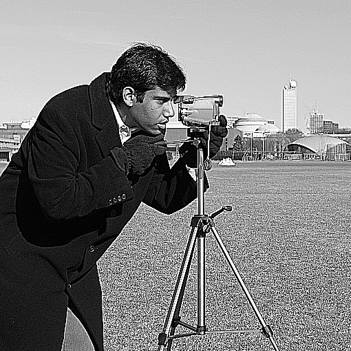
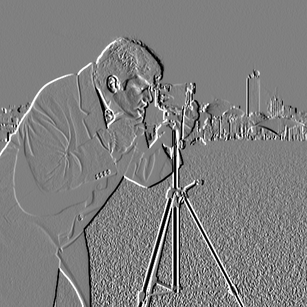
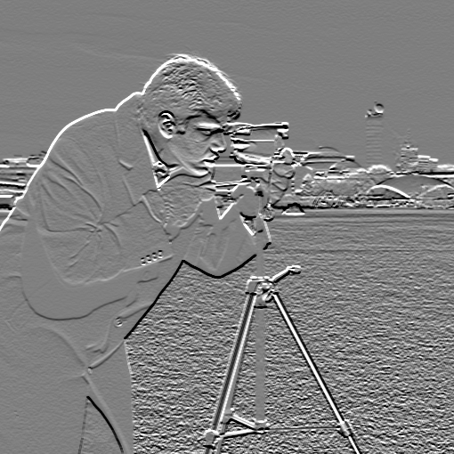
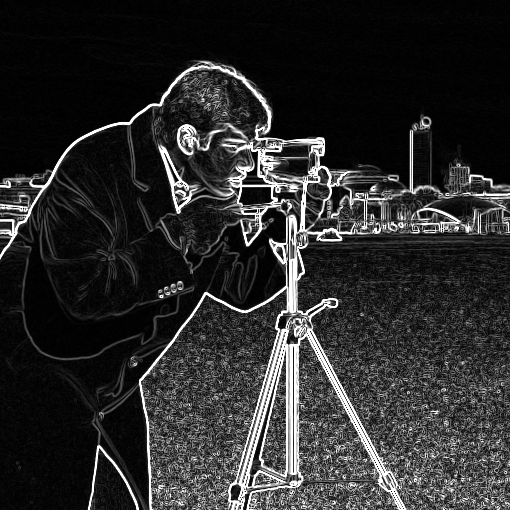
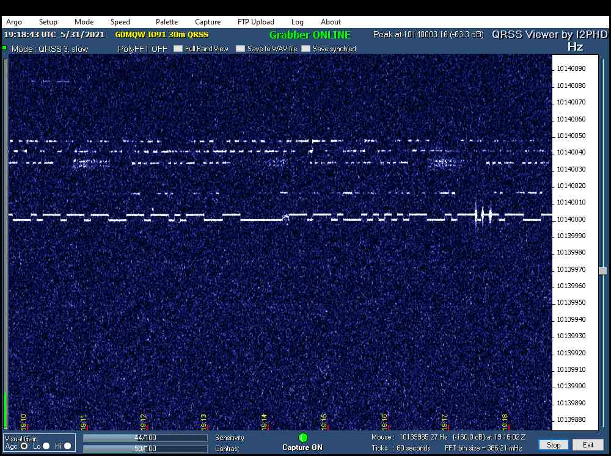
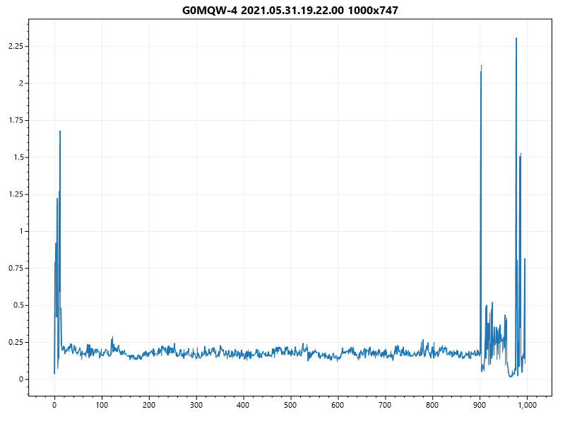

# Csharp Image Analysis

**This repository contains notes and code related to image transformation and analysis using pure C#.** 

The primary goal of this repository is to organize code samples and notes for educational purposes. A secondary goal of this repository is to collect useful image manipulation and analysis code in one place under a MIT license so developers can copy/paste what they need without taking on a large framework or sticky license. 

## Example Operations

Code that generated these images is in the test project.

### Blur and Sharpen

Original | Box Blur | Gaussian Blur | Sharpen
---|---|---|---
|||

### Edge Detection

Original | Left Edge | Top Edge | [Sobel](https://en.wikipedia.org/wiki/Sobel_operator)
---|---|---|---
|||

Original Image | Data Area Detection
---|---
|

## Resources

### Software
* [ImageSharp](https://github.com/SixLabors/ImageSharp) - [Processing Image Operations](https://docs.sixlabors.com/articles/imagesharp/processing.html)
* [AForge.NET - Image Processing samples](http://www.aforgenet.com/framework/samples/image_processing.html)
* [CSharpImageLibrary](https://github.com/KFreon/CSharpImageLibrary) - No longer maintained. Image processing library written entirely in C# and Nuget Packages. Looks like it focuses largely on obscure format IO.
* [ImageProcessor](https://imageprocessor.org/) - Same author as ImageSharp, and not recommended for use because it does not and will not support modern .NET platforms. Its source code may be useful to review though.
* [Emgu CV](https://www.emgu.com/) - A cross platform .Net wrapper to the OpenCV image processing library.

### YouTube
* https://youtu.be/d1CIV9irQAY - Image Analysis in Python with SciPy and Scikit Image - introduces 2D/3D arrays for images with good examples of convolution for filtering and edge detection

### Websites
* https://softwarebydefault.com/code-samples - well-documented examples of image manipulation with C#
* https://epochabuse.com/gaussian-blur - C# Tutorial: How To Create Gaussian Blur
* http://blog.ivank.net/fastest-gaussian-blur.html - Fastest Gaussian Blur - comparison of 4 algorithms
* http://haishibai.blogspot.com/2009/09/image-processing-c-tutorial-4-gaussian.html - Haishi's Blog - Image processing C# tutorial 4 – Gaussian blur
* https://www.codeproject.com/Articles/2008/Image-Processing-for-Dummies-with-C-and-GDI-Part-2 - Image Processing for Dummies with C# and GDI+ Part 2 - Convolution Filters